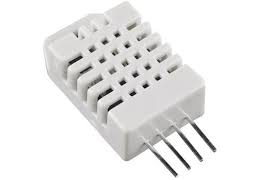

# Static Guard

**Static Guard** (SG) is device which is placed on roads. It samples telemetries about traffic and weather conditions (i.e. temperature, rain and humidity),
then shares them to server.

## Hardware

SG uses **Arduino R4 WiFi** as micro-controller and it is equipped with different sensors:

- Rain Gauge
- Temperature and humidity sensor
- Laser photocells

### Arduino R4 WiFi


Arduino R4 WiFi was picked given that it offers WiFi connectivity, which is used to send telemetries to server.

### Rain Gauge


Rain gauge has a dry contact which is closed when approximately 0.3mm of rain felt.

### Temperature and humidity sensor



Temperature and humidity are sampled by an unique sensor: DHT22.


### Laser photocells

Laser photocells are used to capture vehicles transits. In particular, there are two photocells, both of them must be activated to have a transit.

For example, suppose that the first one is the right photocell. Valid transit must follow these activations:

1. Right photocell is activated
2. Left photocell is activated
3. Right photocell is deactivated
4. Left photocell is deactivated


## Firmware

Firmware was developed using Ino IDE, splitting code into two main components (i.e. bridge and device) and their support classes (e.g. telemetries classes), in order to ensure a good independence
among modules.

### Libraries used

- `ArduinoGraphics` (by Arduino) to manage LED matrix
- `ArduinoHttpClient` (by Arduino)
- `NTPClient` (by Fabrice Weinberg)
- `Adafruit Unified Sensor` (by Adafruit)
- `DHT sensor library` (by Adafruit)

### Telemetry

`Telemetry` is an abstract class implemented by real telemetries such as `TemperatureTelemetry`, `HumidityTelemetry` and so on.

Telemetries classes has all needed attributes to store them into database.

Every class must implement `toGraphqlMutationBody` method, in order to generate its GraphQL mutation which will be sent to GraphQL server.

### Bridge

Bridge is the module which manages connection between device and server.

Bridge class uses singleton pattern and has:

- `WiFiClient` to manage WiFi connectivity
- `HttpClient` to open HTTP connection with server
- `NTPClient` to synchronize internal time (it is used to timestamp telemetries)
- Bucket of `Telemetry` (i.e. array of `Telemetry` pointers)
- Configuration having network credentials, timeout thresholds and so on

Bridge temporarily stores telemetries into the bucket and, when the bucket becomes too full, it sends stored telemetries to server.

Telemetries can be put into bucket using `put` method and they can be sent using `send` or `sendWithRetry` methods.

Bridge can elaborate stored telemetries when `work` method is called.

Bridge has also a `setup` method to initialize itself and its clients.


#### Send

`send` method performs HTTP request to GraphQL API of server, building mutation body using `toGraphqlMutationBody` of all telemetries stored into the bucket.

`send` is wrapped in `sendWithRetry` which retries if any error occurs. If bucket is filled before that it can be emptied through sending, telemetries will be lost.

### Device

Device represents the static guard device. It is also created using singleton pattern and has a very wide configuration which can be used to manage device parameters.

Device class has a `work` method in which every kind of elaborations is placed. `work` method is called in main `loop` function.

Device has also a `setup` method to initialize itself and its components, which is called from main `setup` function. For example, in device setup phase, bridge `setup` is called.

#### Temperature and Humidity

Temperature and humidity data are sampled in `handleTemperature` and `handleHumidity` called in `work` method if a pre-designed amount of time is elapsed. DHT22 sensor is handled using `DHT` of `DHT.h` library.

In this block of code there is the common way used to take data and time, in order to produce a new telemetry (which then is put into bridge bucket).

```c
float temperature = dht->readTemperature() + configuration.temperatureOffset;

unsigned long timestamp = bridge->getEpochTimeFromNtpServerInSeconds();

Telemetry* temperatureTelemetry = new TemperatureTelemetry(configuration.deviceId, timestamp, temperature);

bridge->put(temperatureTelemetry);
```

If any error occurs, a `FailAlert` is created.

```c
FailAlert* failAlert = new FailAlert(configuration.deviceId, timestamp, "HT002", "Fail to read temperature");
bridge->put(failAlert);
```

#### Rain Gauge

Rain gauge data are handled using *interrupts*. Every time that rain gauge flips a counter is updated, then in `elaborateRainGaugeUnhandledSamples` telemetries are built.

#### Transits

Vehicles transits telemetries are produced using laser photocells. Device class has two `UnsignedLongQueue` (queue structure), one for each photocell.

Transits are handled using *interrupts*. When a photocell is triggered an interrupt is produced and time in micro seconds (`micros` function) is saved.

Then, in `elaborateTransitTriggersUnhandledSamples` are computed delta times, velocities and telemetries for unhandled samples.


## Future development

In this section there is a list of future ideas which could be implemented to upgrade this device.

- Bluetooth connection to allow an operator to analyze device and set the device ID or take serial number


